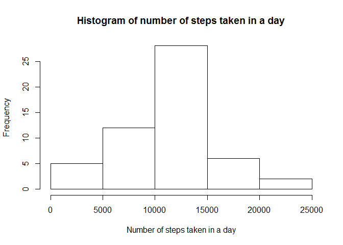
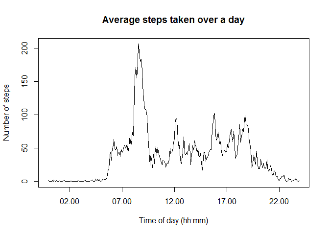
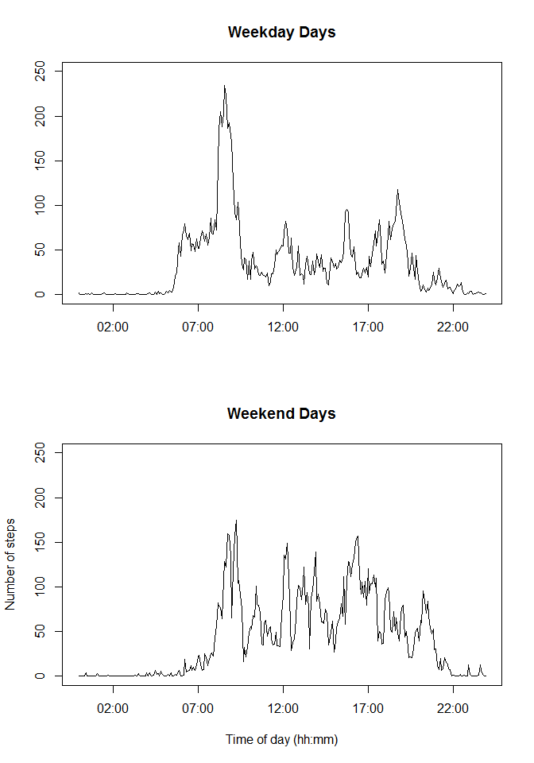

# Reproducible Research: Peer Assessment 1

### Introduction

This is an exercise to write up a simple data analysis using R Markdown. 

### Loading and preprocessing the data

##### Set the working directory

Before we start, we need to set the working directory. I haven't yet found a good process for doing this automatically, so let's do this manually. To do this in Rstudio, open this file then choose:
```
Session | Set Working Directory | To Source File Location
```
##### Load the activity data set 

Load the activity data from the current directory:

```r
activity <- read.csv(unzip("activity.zip", "activity.csv", overwrite=TRUE))
```
Look at the structure of the data (number of observations, number of variables, type of each variable, etc.)

```r
str(activity)
```

```
## 'data.frame':	17568 obs. of  3 variables:
##  $ steps   : int  NA NA NA NA NA NA NA NA NA NA ...
##  $ date    : Factor w/ 61 levels "2012-10-01","2012-10-02",..: 1 1 1 1 1 1 1 1 1 1 ...
##  $ interval: int  0 5 10 15 20 25 30 35 40 45 ...
```

##### Add a varible to identify the hour and minute of the measurements

We see that the time of day of a measurement is reported in the 'interval' variable. At first glance, the interval looks like an integer number of minutes (e.g, 5, 10, 15, etc.):

```r
head(activity$interval)
```

```
## [1]  0  5 10 15 20 25
```

But looking at values at the end of the day, we see its really an hour and minute identifier of the form 'hhmm':

```r
tail(activity$interval)
```

```
## [1] 2330 2335 2340 2345 2350 2355
```

Let's create an fixed-length character string, with leading 0's for the early hours, that we can use for time-of-day analysis:

```r
activity$hhmm <- sprintf("%04d", activity$interval)
head(activity$hhmm)
```

```
## [1] "0000" "0005" "0010" "0015" "0020" "0025"
```

##### Add a categorical variable for weekday vs weekend analysis

Now, create categorical variable that tells whether the day is a weekday or weekend day. Using the lubridate package,
* Use ymd() to convert the given date string into a posix time stamp
* Use wday() function to get the day of the week as a decimal number 01-07 with Sunday as 1
* Categorize days 1 and 7 as weekend and the others as weekday

```r
library(lubridate)

day_of_week <- wday(ymd(activity$date))

# Helper function to map day of week to our category values
# There has to be an easier way to do this
f <- function(i) {
  day_to_category <- c('weekend', 
                       'weekday', 
                       'weekday',
                       'weekday',
                       'weekday',
                       'weekday',
                       'weekend')
  
  return (day_to_category[i])
}
 
activity$time_of_week <- sapply(day_of_week, f)
head(activity$time_of_week)
```

```
## [1] "weekday" "weekday" "weekday" "weekday" "weekday" "weekday"
```

##### The amended activty data set
Here's a summary of the final activity data:

```r
str(activity)
```

```
## 'data.frame':	17568 obs. of  5 variables:
##  $ steps       : int  NA NA NA NA NA NA NA NA NA NA ...
##  $ date        : Factor w/ 61 levels "2012-10-01","2012-10-02",..: 1 1 1 1 1 1 1 1 1 1 ...
##  $ interval    : int  0 5 10 15 20 25 30 35 40 45 ...
##  $ hhmm        : chr  "0000" "0005" "0010" "0015" ...
##  $ time_of_week: chr  "weekday" "weekday" "weekday" "weekday" ...
```


### What is mean total number of steps taken per day?

##### Compute the total number of steps taken per day

Create a table (steps_per_day) with the total number of steps taken each day. To do this, use the dplyr package to group the activity table by date and sum the number of taken each each day:

```r
suppressPackageStartupMessages(library(dplyr))
steps_per_day <- activity %>% group_by(date) %>% summarise(steps = sum(steps))
head(steps_per_day)
```

```
## Source: local data frame [6 x 2]
## 
##         date steps
## 1 2012-10-01    NA
## 2 2012-10-02   126
## 3 2012-10-03 11352
## 4 2012-10-04 12116
## 5 2012-10-05 13294
## 6 2012-10-06 15420
```

##### Plot a histogram of the total number of steps per day

Let's look at the distribution of steps taken in a day:

```r
hist(steps_per_day$steps, 
     xlab = "Number of steps taken in a day",
     main = "Histogram of number of steps taken in a day")
```

 

##### Compute the mean and median of the total number of steps per day

Compute the mean and median of the steps taken per day, ignoring NA values:

```r
mean_steps_per_day <- mean(steps_per_day$steps, na.rm = TRUE)
median_steps_per_day <- median(steps_per_day$steps, na.rm = TRUE)
```
For fun, let's report the mean and median in-line in the text: 

* The mean number of steps per day is 10,766.19
* The median steps per day is 10,765

There was a small bit of hidden code to format the numbers for display - round the mean to 2 decimal paces and use commas in both numbers. Here is the code for those lines:
```
* The mean number of steps per day is ` r format(round(mean_steps_per_day, 2), big.mark=',')`
* The median steps per day is ` r format(median_steps_per_day, big.mark=',')`
```

### What is the average daily activity pattern?

##### Compute the average number of steps in each interval across all days

Compute the average number of steps taken in each 5-min interval across all days, ignoring NA values:

```r
steps_per_interval <- activity %>% group_by(hhmm) %>% summarise(steps = mean(steps, na.rm=TRUE))
head(steps_per_interval)
```

```
## Source: local data frame [6 x 2]
## 
##   hhmm     steps
## 1 0000 1.7169811
## 2 0005 0.3396226
## 3 0010 0.1320755
## 4 0015 0.1509434
## 5 0020 0.0754717
## 6 0025 2.0943396
```

```r
str(steps_per_interval)
```

```
## Classes 'tbl_df', 'tbl' and 'data.frame':	288 obs. of  2 variables:
##  $ hhmm : chr  "0000" "0005" "0010" "0015" ...
##  $ steps: num  1.717 0.3396 0.1321 0.1509 0.0755 ...
##  - attr(*, "drop")= logi TRUE
```

##### Plot the average number of sets over the day

Let's plot that time series. To get a pretty x-axis label, convert hhmm variable to a real timestamp using the strptime() function:

```r
plot(x = strptime(steps_per_interval$hhmm, format('%H%M')), 
     y = steps_per_interval$steps,
     type='l',
     main="Average steps taken over a day",
     xlab="Time of day (hh:mm)",
     ylab="Number of steps")
```

 

##### Find the interval with the maximum number of steps

Use the which.max() function to find the index of the row that has the maximum number of steps. Extract that row the data:

```r
steps_per_interval[which.max(steps_per_interval$steps),]
```

```
## Source: local data frame [1 x 2]
## 
##   hhmm    steps
## 1 0835 206.1698
```

### Imputing missing values

##### [TODO]
...

### Are there differences in activity patterns between weekdays and weekends?

##### Compute the average weekday and weekend activity patterns 

Use the categorical attribute we added earlier to compute the average weekday and weekend patterns.

Compute the average number of steps for each 5-min interval over all weekday days:

```r
weekday_steps_per_interval <- activity %>% 
                                filter(time_of_week == 'weekday') %>% 
                                group_by(hhmm) %>% 
                                summarise(steps = mean(steps, na.rm=TRUE))
summary(weekday_steps_per_interval)
```

```
##      hhmm               steps        
##  Length:288         Min.   :  0.000  
##  Class :character   1st Qu.:  2.218  
##  Mode  :character   Median : 23.974  
##                     Mean   : 35.338  
##                     3rd Qu.: 51.872  
##                     Max.   :234.103
```

Compute the average number of steps for each 5-min interval over all weekend days:

```r
weekend_steps_per_interval <- activity %>% 
                                filter(time_of_week == 'weekend') %>% 
                                group_by(hhmm) %>% 
                                summarise(steps = mean(steps, na.rm=TRUE))
summary(weekend_steps_per_interval)
```

```
##      hhmm               steps        
##  Length:288         Min.   :  0.000  
##  Class :character   1st Qu.:  1.107  
##  Mode  :character   Median : 32.036  
##                     Mean   : 43.078  
##                     3rd Qu.: 75.571  
##                     Max.   :175.000
```

##### Plot the weekend and weekday average activty in a panel plot

Let's use the base graphics package (Even though it would probably be easier and prettier to use lattice or ggplot, we can just reuse the plot we did above and tweek the data being shown):

```r
par(mfrow=c(2,1))

plot(x = strptime(weekday_steps_per_interval$hhmm, format('%H%M')), 
     y = weekday_steps_per_interval$steps,
     type='l',
     main="Weekday Days",
     xlab="",
     ylab="",
     ylim=c(0,250))

plot(x = strptime(weekend_steps_per_interval$hhmm, format('%H%M')), 
     y = weekend_steps_per_interval$steps,
     type='l',
     main="Weekend Days",
     xlab="Time of day (hh:mm)",
     ylab="Number of steps",
     ylim=c(0,250))
```

 

